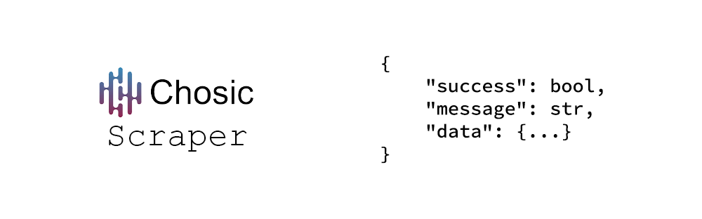

# Chosic Scraper



**Chosic Scraper** is a tool for extracting rich data from <a href="https://www.chosic.com">Choisc.com</a> using web scraping.

⚠️ This project is unofficial and purely for educational purposes. No official Chosic API used.

<br>

## 📦 Installation

```bash
git clone https://github.com/Abssdghi/chosic_scraper.git
cd chosic_scraper
pip install -r requirements.txt
```


<br>


## 🔧 Functions

| Function               | Parameters                    | Description                                          |
|------------------------|------------------------------|------------------------------------------------------|
| `search(keyword)`      | `keyword: str`                | Search |


Each function returns structured JSON containing metadata, URLs, images, previews, and related data.


<br>

## 🧠 Usage

Just import the scraper and call your function:

```python
from chosic_scraper import *


```

<br>

## 📄 License

This project is licensed under the [MIT License](LICENSE).

<br>

## 🌟 Give it a Star

If you found this useful, feel free to ⭐️ the repo and share it with others!

<br>

Made with ☕ and 🎧 by [Abbas Sadeghi](https://github.com/abssdghi)